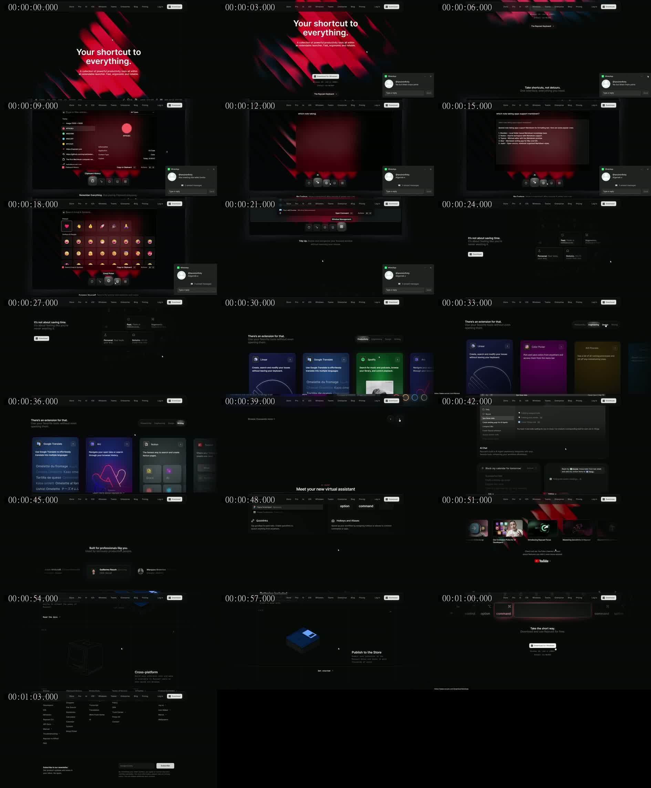
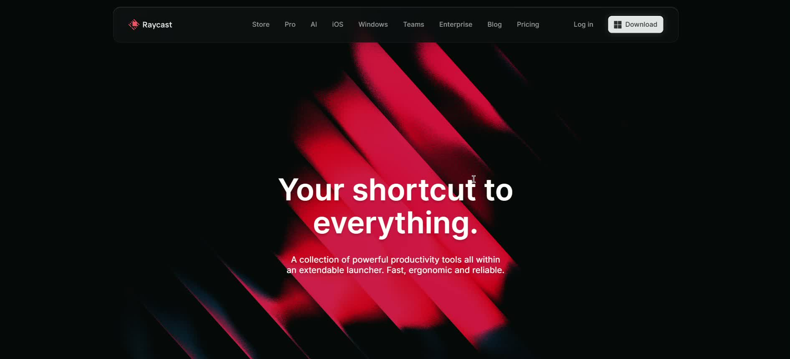
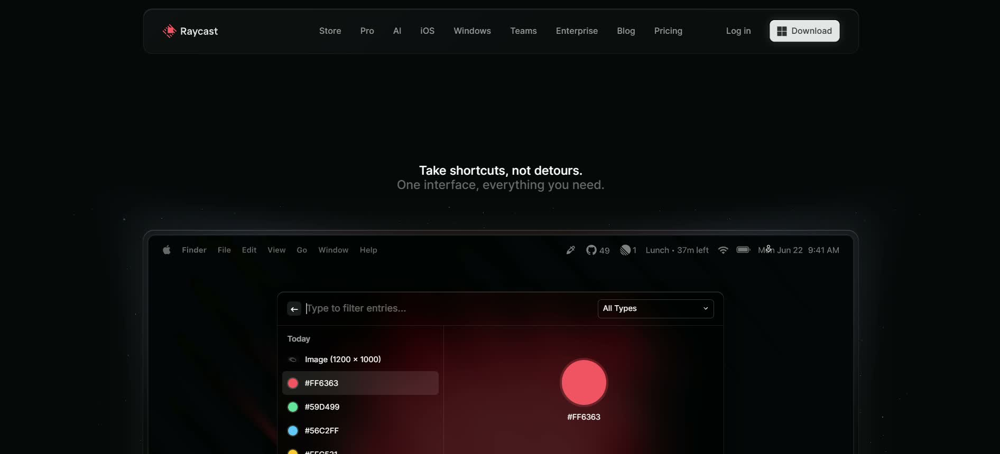
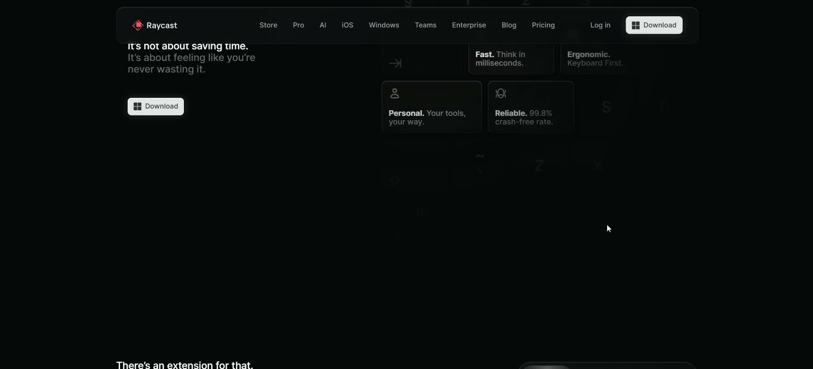
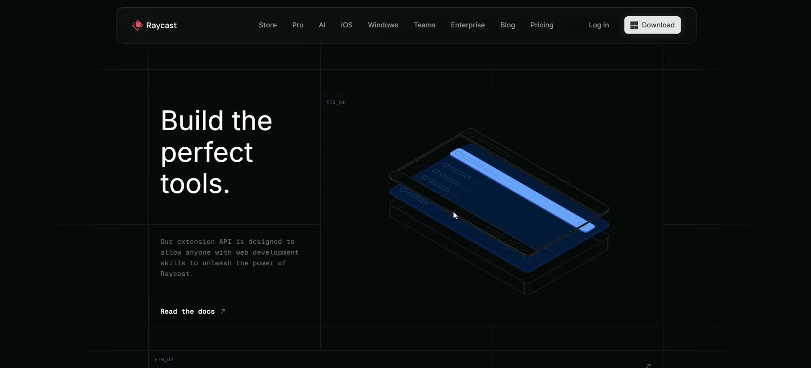
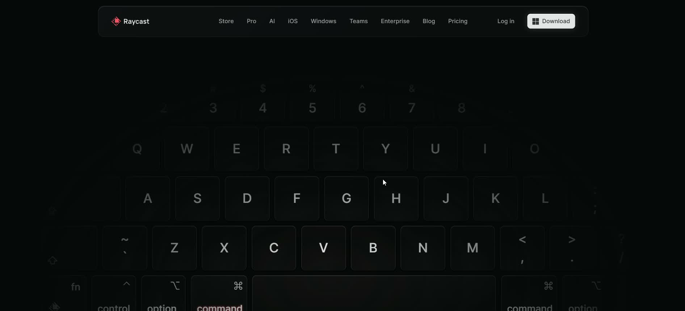

# Raycast reference: precise visual and interaction analysis

Reviewed 2026-09-26. Primary evidence: the user-supplied 65.23-second recording, 1892 × 860 pixels, 30 fps. Secondary evidence: [Raycast's live homepage](https://www.raycast.com/). The supplied hero screenshot reinforces the diagonal-band composition.

This is a reverse-engineering description, not a copy of Raycast's source or a claim to have inspected all linked pages. The recording shows one desktop homepage. Mobile layouts, underlying shaders, DOM semantics, measured contrast, exact fonts, computed CSS, easing functions, and complete hover states cannot be established from it.

## Evidence legend

- **Observed:** visible in the recording/keyframes.
- **Estimate:** approximate proportions or material judgments from pixels.
- **Live check:** a narrow factual correction supported by the current homepage.
- **Design translation:** a proposal for TimeMachine, not observed Raycast behavior.

The contact sheet samples every three seconds. Ten larger frames are retained in `reference/`. These frames are reference evidence only, not licensed production artwork. The original video remains at the user's supplied location and has not been copied into the repository. A WhatsApp notification visible during the recording is external OS/app chrome, not website UI.

## 1. Overall art direction

**Observed:** nearly black ground, white dominant headings, dimmer gray explanatory text, highly saturated red illumination in the opening. Later sections introduce colored tool panels and blue technical illustrations. The page repeatedly alternates a visually dense product object with expanses of dark negative space. The palette is not red everywhere: the hero gives the page its signature while the products supply local color.

**Estimate:** the canvas reads black with a small green/blue bias in the captured display. This is not evidence for an exact hexadecimal background. The user's #000000–#0A0A0A range is a reasonable proposed reconstruction range. Similarly, #E5484D is a reference approximation, not a sampled brand specification.

**Observed:** typography is predominantly sans-serif. Major headings are heavy and tightly set; secondary passages use lighter/muted text. Key labels and developer captions use a monospaced appearance. Text density rises inside the product illustrations but the outer marketing copy stays brief.

**Principle:** contrast has several jobs: white identifies the main message and action, gray distinguishes support from emphasis, and colored light places attention on the product. Replacing every gray with a glowing accent would destroy that hierarchy.

## 2. Persistent navigation, approximately 00:00–01:05

At 00:00, the rounded navigation island occupies roughly the middle 72% of the recorded width, with its top about 17 captured pixels below the frame edge. These are video coordinates, not browser CSS measurements. It has a dark translucent fill, a low-contrast one-pixel-looking outline, a softly lit upper rim, and large rounded corners. It is neither a rectangular edge-to-edge banner nor a full capsule.

The wordmark and icon sit left, multiple small links form one row in the center, and login plus the white download control sit right. The right CTA is the brightest rectangular object in the bar. Its corners are rounded more tightly than the containing island, creating an inset-control relationship. The Windows symbol indicates platform-targeted download in this recording.

The same nav remains in nearly the same viewport position as the page scrolls, establishing persistence. That does not establish whether the implementation uses `fixed`, sticky positioning, or a portal.

**Translation:** retain a floating rounded island, but use TimeMachine's wordmark, a smaller set of anchors, Log in, and Start chatting. Do not invent OS downloads. Strong blur alone is not enough; tint must keep background content from competing with nav labels.

## 3. Hero artwork and composition, approximately 00:00–00:06

The hero is centered. A broad block of diagonal illuminated material passes behind its headline. The visible bands run from upper-left toward lower-right, approximately 45 degrees to the horizontal. Several parallel bands alternate between bright red faces, black gaps, shadowed faces, and very thin edge lines. Their ends and sides disperse into fine grain rather than a hard solid fill.

This is important: the image is not merely red square gridlines. It is closer to layered rails, folded planes, or ribbons lit from within. Thin seams and partially illuminated edges create a grid-like structure. The black gaps preserve spatial depth, and the unequal widths/brightness prevent the object from becoming a repetitive striped wallpaper.

The brightest field concentrates around the center/lower-center; outer diagonals extend beyond the visible frame and disappear into black. Text stays flat and opaque in front of this artwork. The headline uses two lines, its first line wider than its second. The explanatory paragraph is substantially smaller and narrower, centered below with a distinct gap.

**Animation limits:** across early frames, artwork composition changes in relation to the viewport while the user also scrolls. The recording alone cannot separate every shader transformation from scroll displacement. It supports the intended animated/cinematic effect, not an exact cycle length, keyframe sequence, or implementation technology. A still screenshot cannot verify loop behavior.

**Translation:** author original purple-dominant rails with restrained pink/cyan phases; keep their broad surfaces, dark negative space, granular edges, and sharp seams. Make light travel along the rails; do not rotate the entire page, wash all text in color, or substitute a generic orbiting sphere. Use a stable headline and clear CTA above the moving scene.

## 4. Hero exit and command-window theatre, approximately 00:06–00:22

A small two-line section introduction establishes one interface as the organizing concept. A large rounded screen frame appears below, with a simulated desktop menu/status strip. Within it, a smaller launcher window is centered. This gives two layers of context: an environment and the working tool. A dark launcher shell remains recognizable while the interior changes.

The clipboard view uses a search row at top, a filter aligned right, a vertical entry list left, and a detail preview right. Selected items get a filled highlight. Colored circles and hexadecimal strings make clipboard contents quickly recognizable. Fine separators distinguish search chrome, list, and preview without turning the interface into many disconnected cards.

The AI view replaces the list/detail content with a natural-language prompt and a response. The emoji view uses a categorized icon grid, with prominent emojis and fine labels. The window-management view represents a command list and desktop snapping context. Small rounded icon controls beneath the stage identify these modes; the selected control has a brighter surface/outline. Feature captions below the controls explain why the state matters.

**Observed interaction:** the recording changes among these views without a full-page navigation. The stable outer geometry prevents the visitor from having to relocate the demonstration. Exact transition interpolation and focus behavior were not measured.

**Translation:** TimeMachine should use a stable stage for Chat, Contour, Notes, and Max Mode. These are real product divisions; clipboard history, emoji picker, and OS snapping should not be copied as capabilities. Desktop toolbar decoration is optional; TimeMachine is browser-based and should not imply it controls the OS.

## 5. Value statement and keyboard field, approximately 00:23–00:29

The structure becomes a two-part composition: a short left statement plus CTA and a right group of four capability blocks. The right blocks are aligned to a faint keyboard landscape, with low-contrast key shapes extending beyond them. The keyboard serves as a visual explanation of ergonomic speed rather than a random background image.

The statement deliberately distinguishes benefit from mechanism. The capability blocks attach a short emphasized word to a supporting sentence. Sparse icons add recognition without dominating the text. The captured shapes have curved corners, subtle rims, and a low-opacity fill; they are not uniformly luminous glass tiles.

**Correction:** the visible reliability figure is **99.8%**, not the 99.9% in the user's draft; the live page agrees. This is Raycast's claim, never a claim to transfer to TimeMachine.

**Translation:** use qualitative capabilities backed by demos: three voices, inline tools, connected notes, and deeper coding workflows. Use `/`, `@girlie`, and `@pro` as meaningful graphic notation. Do not show a keyboard shortcut that the app does not implement.

## 6. Tool/extension carousel, approximately 00:30–00:38

The next area has a heading and concise supporting line aligned on one side, category controls on the other, and tall colorful cards below. A partial card at the right edge indicates more content beyond the viewport. Arrow controls provide a second way to navigate besides gestures. The gallery is product-led: cards combine recognizable names, concise descriptions, and app-like content or illustrations.

Category changes visibly replace the card set. Different cards have different color atmospheres while retaining coherent proportions and typography. Some use miniature application content, others use abstract authored illustrations. This avoids making every capability look like an identical icon tile.

**Translation:** a Contour gallery grouped by Writing, Planning, and Utilities, with honest commands such as Prompt Optimizer, Calculator, Timer, Snippets, and Converter. Showcase existing commands, not a public extension store. Use native horizontal scrolling with snap plus buttons; category transitions must not move keyboard focus or force the page sideways.

## 7. Agent section, approximately 00:39–00:43

The composition begins quietly: a small label, centered headline, and large dark area before the rich chat demonstration. The sample has a conversation list/sidebar and an agent conversation showing a task broken into steps. A tool action has its own icon/name/state; the final reply is visually distinct from tool execution. Below are smaller complementary AI tools, not four equivalent hero windows.

The recording establishes a visual vocabulary for activity, but it does not establish backend execution, credentials, or how the demo is powered.

**Translation:** demonstrate PRO/Max Mode with a short, local scripted sequence: inspect a synthetic file, propose a change, show a preview. Show the distinction among Plan, Edit, and Auto correctly. Marketing interactions must never execute commands or mutate a repository. Label the simulation as a demo.

## 8. People/social proof, approximately 00:44–00:46

The people area contains a short centered introduction, rows/slider-like selections with avatars/names, and a testimonial display. Human portraits break the preceding sequence of interfaces and illustrations. It signals credibility and adds warmth without changing the core page grammar.

**Limits:** no permission to reuse portraits or quotes follows from their appearance. No linked profile pages were inspected. The user's draft names are not an approved TimeMachine testimonial set.

**Translation:** omit this block until TimeMachine has consented real quotes. In the first release, a clear demonstration or verified product/privacy explanation supplies proof instead. Do not ship fake endorsements or an empty carousel.

## 9. Shortcuts, snippets, quicklinks, and notes, approximately 00:47–00:49

Here the layout mixes sizes in a bento-like arrangement. Different features get different visual demonstrations: expanded text for snippets, a launch context for quicklinks, physical-looking key badges for shortcuts, and a note/editor surface. Headings align with their respective miniature scenes. The arrangement is not just a uniform six-card grid.

The keyboard badges communicate actions through familiar visual notation. The visual does not require the visitor to understand every key symbol to grasp that fewer steps are involved.

**Translation:** use curved liquid-glass bento containing Notes, Prompt Optimizer, inline calculation, and PRO's plan. Each tile demonstrates one actual behavior. A large editor tile can coexist with smaller utility tiles, with one consistent corner and rim grammar.

## 10. Community and media, approximately 00:50–00:52

The page returns to illustrated color behind a media row. Thumbnails, recognizable play/video context, and a compact destination CTA make learning resources discoverable. Community cards provide additional paths beyond conversion.

**Translation:** only use real TimeMachine guides or working destinations. Do not transfer Raycast member/follower counts. A newsletter form requires a working submission path, explicit success/error states, and consent handling; it is not decorative input chrome. Without those inputs, first release uses existing Help and Contact links.

## 11. Developer illustration chapters, approximately 00:53–00:58

This is a distinctive shift from soft product imagery to technical explanatory drawing. A low-contrast orthogonal grid divides a wide canvas. A large stacked headline and small mono-style explanation occupy one cell, with a much larger isometric illustration in another. Tiny figure labels create a designed-document/blueprint feel.

At 00:54 the object resembles an exploded interface stack: bright blue plates sit inside transparent wireframe outlines, separated vertically along a consistent isometric projection. Some layers are solid and some are just edges, which makes the construction legible. At later frames, a blue floppy-disk-like solid object demonstrates a different pillar. The user's Macintosh, switch, and battery inventory is plausible as source context, but every exact object is not legibly captured in the sampled video; it must not be represented as exhaustively verified.

**Translation:** original exploded plates for conversation, note, prompt, and workspace; cyan/violet highlights, not copied Raycast objects. Use this visual system for Max Mode architecture, not a nonexistent third-party extension API. Annotate actual product concepts and label synthetic examples.

## 12. Closing keyboard and footer, approximately 00:59–01:05

An oversized keyboard illustration brings the recurring keyboard metaphor back to the ending. Most keys are dark; a pair of relevant controls acquires red emphasis. The close pairs this visual with a short headline and a repeated conversion action. It feels like the same product story returning to its starting point, rather than an unrelated final gradient banner.

The footer is dense and organized into multiple link groups. The brand/product area, feature links, company/legal, community, and adjacent products each have distinct headings. Newsletter entry sits at the lower portion. Small text is deliberately lower-salience than the close's main CTA.

**Translation:** close with one original glass command key marked `/` or a composer motif, using a violet edge-light path. Pair it with Start chatting. Use actual TimeMachine routes; include privacy/terms. No fake newsletter or empty company pages.

## 13. Corrections and uncertainty register

| User draft assumption | Finding or treatment |
|---|---|
| Exact black/red hexadecimal palette | Useful estimates; not inspected computed CSS |
| 1200px container and 80–140px gaps | Proposed range, not verified reference measurements |
| Neo-grotesque typography | Visible category; exact licensed family not identified |
| Sticky/fixed navbar | Persistence is observed; positioning implementation unknown |
| Red gridlines | Broad illuminated diagonal planes/rails plus fine seams |
| 99.9% reliability | Recording/live page show 99.8%; never transfer the claim |
| Seamless tab transitions | State continuity observed; exact timings/easing are unmeasured |
| Fully liquid-glass reference | User-added TimeMachine direction; Raycast's source is generally darker and flatter |
| All Raycast pages covered | Homepage only; linked destinations not exhaustively inspected |
| Mobile UX verified | No mobile recording; proposed mobile behavior needs independent QA |
| Screen popover is website UI | WhatsApp notification is external and excluded |

## 14. The design synthesis

Keep Raycast's **composition discipline, stable demonstration stage, feature-specific content, tactile illustration, and clear conversion path**. Add the user's Apple-inspired **rounded liquid-glass navigation, controls, and bento modules**. Preserve TimeMachine's actual palette and capabilities.

The main risk is not insufficient spectacle. It is glass so clear that content collides with the artwork, demos so tiny that they become decoration, and animations so busy that the CTA disappears. The implementation plan resolves these with layered material weights, opaque text-bearing interiors, a clipped hero-only motion field, a clear pause option, and mobile-specific demo compositions.
