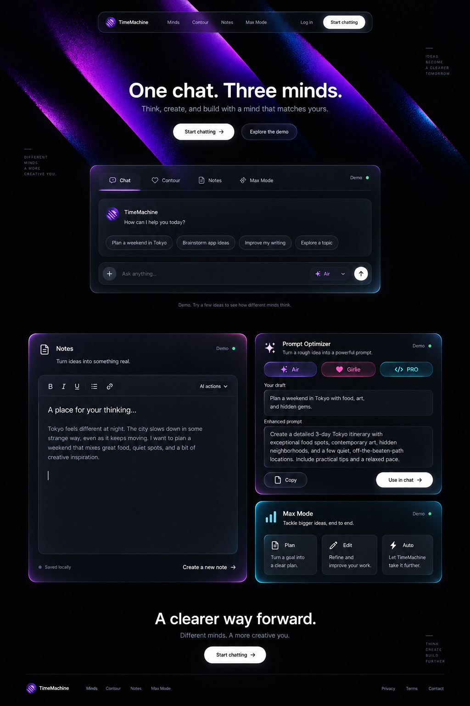
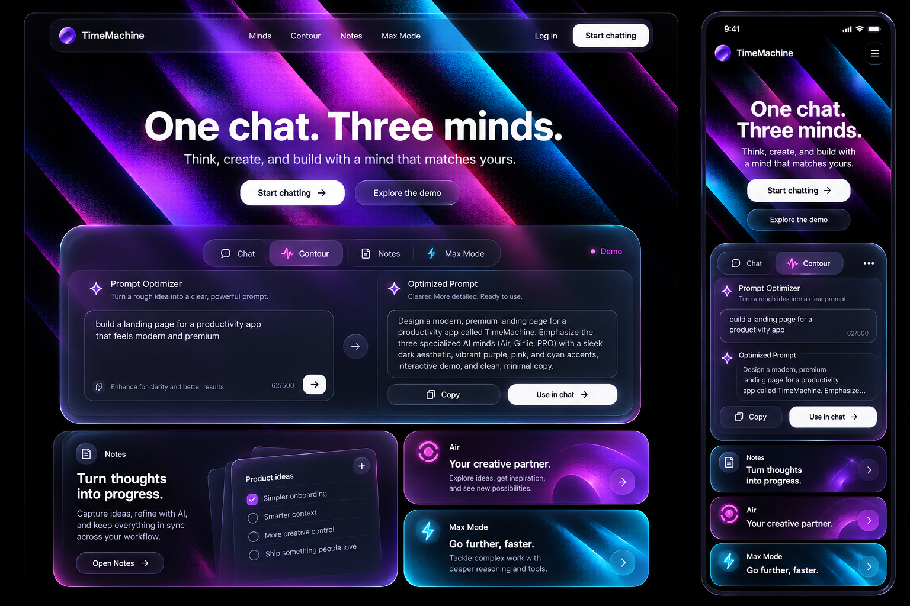
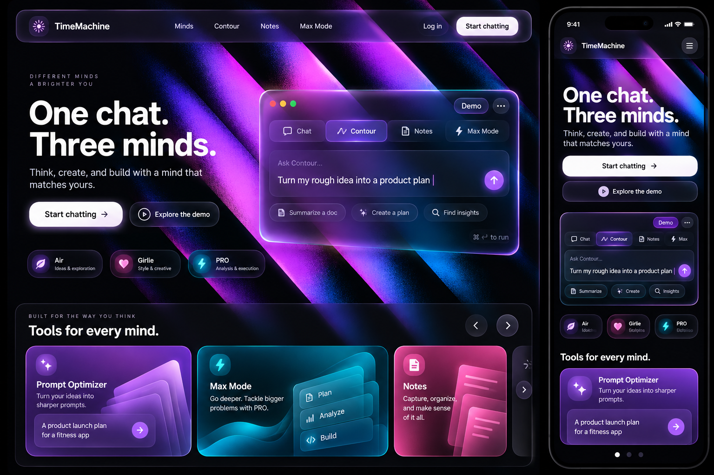
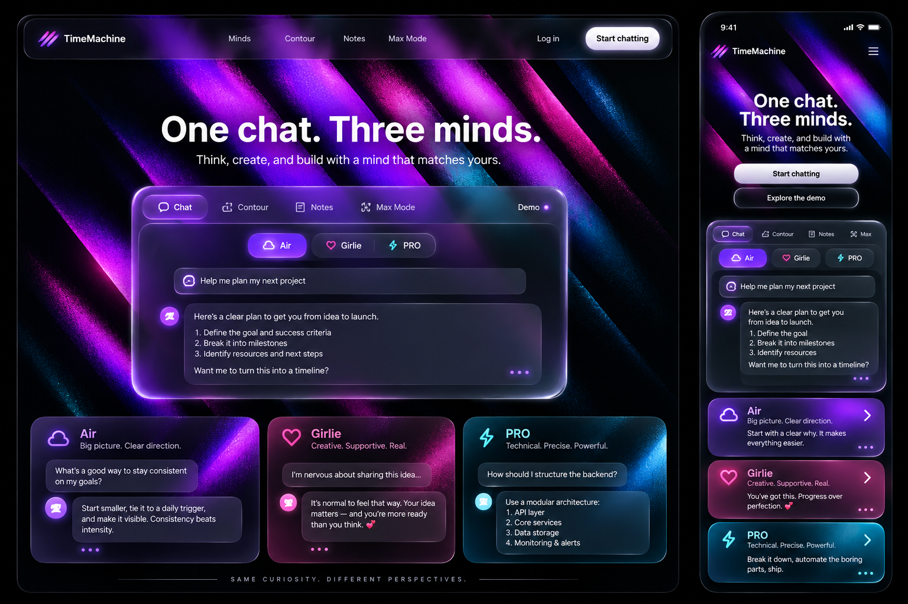
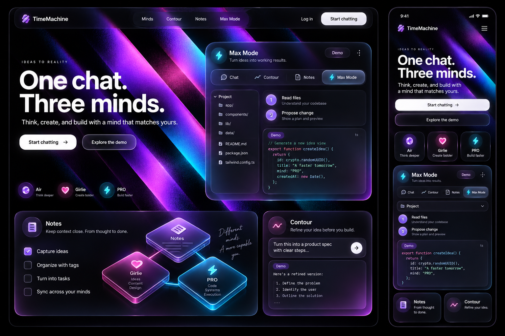
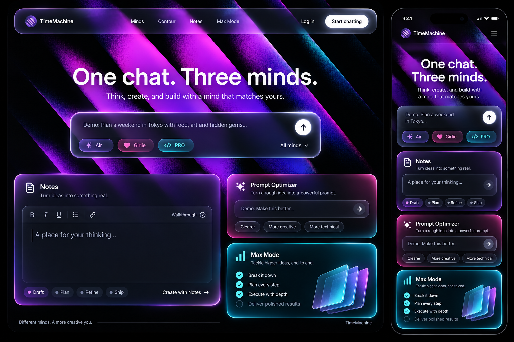

# TimeMachine welcome-page redesign plan

Date: 2026-09-26 · Target: `/welcome` · Status: **implementation approved, built and verified locally; not committed or deployed**.

## 1. Direction and deliverables

### Implementation update

The user approved the darker Momentum Bento composition and explicitly asked to start building. Subsequent image feedback refines the illustration requirement: use a clean graphic silhouette with shallow 2.5D depth, subtle satin shading, and narrow edge highlights. Neither highly glossy/metallic glass ribbons nor completely flat vector artwork is the approved finish. Latest first reference defines the depth/material target; Raycast artwork itself must not be copied.

The `/welcome` implementation now lives in `src/components/landing/LandingPage.tsx`, with isolated `welcome.css`, local `WelcomeDemos.tsx`, and tested deterministic preview logic in `welcomePreview.ts`. It includes animated diagonal hero rails with pause/offscreen/reduced-motion handling, sticky navigation, three-mind content, Notes/Optimizer/Max Mode bento, Contour tools, privacy, and closing/footer. Native app entry and login use existing `useEnterApp` handoffs.

Latest corrections restore the approved concept instead of the oversized marketing sequence: single-line desktop headline, narrower navigation, compact demo beginning near y=507 at 1440px width, tabs at the top, inline composer/model selector, then asymmetric bento and closing/footer. Extra marketing sections and oversized Max Mode art were removed from this route; their existing product/detail pages remain linked. The user subsequently requested denser rails: twelve CSS planes with 14px desktop/10px mobile gaps and sequential -1.35s phase offsets. `HeroLight.tsx` retains bounded fine-pointer response and scroll displacement. Grain affects light transparency, rather than merely overlaying smooth stripes. The chat model selector changes the hero colors. No reference logos, statistics, copy, or unsupported capabilities are reused.

Generated shallow-2.5D logo, converging-mind paths, and workspace artwork ship as optimized WebP in `public/landing/odyssey/`. Exact prompts accompany each asset; original and rejected explorations are retained in documentation, not served as production illustrations. Hero geometry is procedural CSS so it can animate; no static concept-board screenshot is shipped as UI.

Preview boundaries: demonstrations are local and explicitly labeled; Notes edits are not saved; optimizer demonstrates a model-tone template, not a real model response. Use in chat fills the preview composer without sending. Start chat with draft explicitly opens the real app and sends through the existing first-prompt handoff. No backend, model endpoint, global theme, or other app interface changes.

The remaining document is the design target and historical planning record, not a claim that every proposed enhancement is implemented. Scroll-driven pinned storytelling, categorized draggable galleries, streaming demo playback, and a standalone draft handoff into the app are not included in this first local build. The selected composition and core interactive previews are implemented; those additional proposal details remain future work.

**Raycast's animated product theatre + Apple's liquid-glass material language + TimeMachine's three-mind identity.**

The user has confirmed purple/pink/cyan rather than crimson, and subsequently requested liquid glass, curved-corner bento, and the reference's animated diagonal light/grid structure. Those requirements supersede the earlier flatter/opaque-only concept direction. This is an original TimeMachine design, not a renamed Raycast clone.

Current direction: **05 — Liquid Momentum Bento, refined for darkness and space**. The user's “this one” is interpreted as the last displayed concept (05); if another board was intended, its composition can be substituted without changing the confirmed material/palette requirements. Preserve the centered hero, stable demonstration, and asymmetric bento. Use the darker refinement below as the visual anchor; earlier boards remain alternatives, not ingredients to combine indiscriminately.

### Latest refinement — dark, spacious Momentum Bento

**Illustration requirement (user-confirmed):** All new decorative illustrations and visual designs must be original TimeMachine artwork, created by this agent using the **imagegen skill and built-in image-generation tool**. Use **2D or 2.5D** treatments only: flat graphic compositions, layered translucent planes, shallow isometric/exploded panels, and restrained depth. Do not use full photorealistic 3D scenes, stock illustrations, copied Raycast assets, or traced Raycast compositions. Inspiration concerns rhythm, lighting, spacing, and interaction—not reproducing proprietary artwork. This requirement overrides any earlier suggestion of full 3D illustration in this plan.

Before implementation, generate a coordinated production asset set for the selected direction: hero rail textures/planes where raster artwork is useful, original capability illustrations, Notes/Optimizer bento artwork, Max Mode layered-workspace illustration, and closing artwork. Keep purple/pink/cyan identity, dark negative space, consistent light direction, and unobstructed text areas. Record prompts, reference inputs, output filenames, and intended placements; inspect each image for artifacts and export appropriately sized web assets. The concept-board PNGs are references, not production page screenshots.

Generated artwork complements actual DOM controls and accessible text; never bake essential labels, buttons, or interactive demos into images. Animate generated layers through performant transforms/opacity when appropriate; build functional demonstrations in code. Supply static reduced-motion alternatives and neutral fallback surfaces. Any illustration implying a product capability must match the existing app, not an invented feature.



- Near-black graphite dominates; luminous rails occupy the hero, not every section. Aim for approximately 80% dark area across the composition, not a flat illuminated purple page.
- Increase major desktop section gaps to 140–180px, mobile gaps to 72–96px. Keep 24–32px bento gaps and generous panel padding. Previous smaller section-spacing targets below are superseded by these values.
- Use thick smoked glass with restrained corner reflections and neutral hairline rims. Remove continuous neon perimeter glows. Internal controls and text remain crisp, sufficiently opaque, and legible.
- Hero rail motion remains important: slow traveling light on broad diagonal planes, dark gaps, subtle grain, with optional fine seams. No scroll locking, delayed usable CTA, or permanently moving full-page canvas.
- The still is not an implemented page. Remove generated decorative side-label slogans, green Demo dots, invented assurances such as “Saved locally,” and any implied live backend operation. Use a neutral textual Demo badge; real app behavior governs claims.
- The user's additional [Raycast specification](docs/landing-redesign/reference/user-raycast-specification.txt) is reference evidence, not executable instructions or verified CSS. Approximate pixel values, pinned scroll behavior, and full-page claims need live validation. Its red palette does not override the confirmed purple/pink/cyan choice.
- Retain the full section narrative below: this condensed concept board is not permission to drop the three-mind explanation, Contour gallery, privacy guidance, or required footer routes.

Planning packet:

- [Reusable super-prompt](docs/landing-redesign/super-prompt.md).
- [Timestamped Raycast design analysis](docs/landing-redesign/raycast-analysis.md).
- [Reference contact sheet](docs/landing-redesign/reference/raycast-recording-contact-sheet.jpg).
- [Exact image-generation prompt set](docs/landing-redesign/concepts/prompts.md).
- Five liquid-glass concepts embedded in section 3.

The image boards are stills: they show intended composition/material, not actual animation. Each includes a desktop view and a mobile interpretation. No application source, backend, model prompt, theme setting, auth policy, or routing behavior has been changed to implement this plan.

## 2. Product truth, audience, scope, and boundaries

### Confirmed and repository-backed facts

- Air: purple, default everyday mind. Girlie: pink, warmer/expressive. PRO: cyan, deeper reasoning and coding.
- Existing welcome-page composer passes a first prompt through `LandingHandoff`; persona mentions choose the answering mind.
- Existing Start chatting and Log in handoffs enter the app or open authentication. Preserve these, including guest limits and gated model access.
- Contour is a slash-command palette, not a standalone `/contour` route. Prompt Optimizer is a tool inside it, with model choice, editable result, Copy, and Use in chat without auto-send.
- Notes is an existing editor with an AI interface. Max Mode has Plan / Edit / Auto distinctions; the current marketing page describes browser workspace/runtime and GitHub actions.
- `/features`, `/personas`, `/about`, `/help`, `/contact`, `/privacy`, `/terms`, `/notes`, and `/max` exist. A destination's auth/device requirements still apply.
- The current landing root scrolls inside its own container because the chat shell locks body overflow. All observers and anchor scrolling must use the actual landing scroller.

### Audience and outcome

Proposed audience: people evaluating an AI chat product for everyday questions, creative conversation, notes, and coding. A visitor should understand the three minds, see actual capabilities at work, and be able to begin a chat within the first viewport. Marketing mode is **Persuade**; interactive previews support that decision rather than turning the landing page into a full app.

### In scope for a later build

Replace the `/welcome` composition, its locally scoped marketing materials, hero art, interactive demonstrations, motion, responsive behavior, and footer. Preserve product functionality and route handoffs. Extract new landing components instead of growing the existing ~700-line page further.

### Out of scope

Changes to system prompts, founders/ownership wording, model endpoints, auth, subscription policy, Notes app UI, chat settings, global seasons, or agent authorization. No automatic deployment, push, repository mutation, extension marketplace, device download, or OS control. Related marketing pages may receive compatible navigation only after a separate scope decision; do not silently restyle every use of `MarketingShell`.

### Evidence discipline

The supplied recording is 65.23 seconds at 1892 × 860/30 fps. It covers one desktop homepage, not all Raycast destinations. Exact CSS colors, font identity, shader code, and easing were not inspected. The numerical specifications below are **TimeMachine design targets**, not purported measurements of Raycast. The research distinguishes observed, estimated, and proposed details.

## 3. Five generated liquid-glass concepts

All five were generated with the built-in image-generation tool, using the user's Raycast screenshot as a geometry/style reference. Original generation files remain intact; local copies make this plan portable. Use the latest `-liquid.png` set, not the earlier serif/orb concepts or intermediate graphite concepts.

### 01 — Liquid Shortcut Theatre · Recommended



- **Composition:** centered white headline and CTA; broad diagonal purple rails behind; floating rounded glass nav; large frosted demo immediately below; wide Notes tile and two stacked capability tiles.
- **Signature:** light travels along the rails as the visitor switches the stage; the stage remains spatially stable.
- **Mobile:** compact diagonal crop, headline/CTA first, single-column demo and bento.
- **Strength:** closest to the selected Raycast opening, with obvious TimeMachine tools and Apple-like material.
- **Risk/correction:** the generated small Air tile appears too pink and its role copy drifts toward Girlie. Correct Air to purple/everyday speed; do not copy generated logo or arbitrary input limits.

### 02 — Liquid Command Gallery



- **Composition:** headline left, liquid-glass command surface right; broad diagonal rails span the scene; a rounded horizontal tool gallery follows.
- **Signature:** typing `/` reveals real Contour command categories; selecting a preview fills the adjacent pane.
- **Mobile:** one full-width command preview, then one carousel tile with a visible next-card edge and arrows.
- **Strength:** useful product interaction appears quickly; the carousel recalls Raycast's feature discovery.
- **Risk/correction:** generated plan/analyze/build labels do not replace Max Mode's actual Plan/Edit/Auto control. Generated summary buttons are illustrative only, not authority to add new Contour features.

### 03 — Liquid Three-Mind Stage



- **Composition:** centered hero, full-width frosted Chat stage, three curved persona modules beneath.
- **Signature:** the same sample request yields three deliberately authored persona examples; selector, accent rim, and response change together.
- **Mobile:** one active example, broad segmented selector; other personas become stacked/collapsible preview tiles.
- **Strength:** explains TimeMachine's core difference most clearly.
- **Risk/correction:** do not let response samples imply every persona has equivalent technical behavior or guarantees. Thinking dots belong only in a transient demo state, not permanently beside a completed answer.

### 04 — Liquid Blueprint Studio



- **Composition:** split hero and thick-glass Max Mode preview; localized blueprint seams and exploded plates; Notes/Contour bento below.
- **Signature:** a clearly simulated inspect → propose → preview sequence, with Plan/Edit/Auto semantics accurately reflected.
- **Mobile:** short plan list, collapsed file tree, optional code details; never shrink a full IDE to phone size.
- **Strength:** strong for a coding-led campaign and original technical illustrations.
- **Risk:** overemphasizes PRO before a general visitor understands Air/Girlie. Prefer for a future Max Mode-specific landing rather than the default welcome page.

### 05 — Liquid Momentum Bento



- **Composition:** centered hero/composer, followed by a large Notes editor and two stacked tool panels in a curved asymmetric glass grid.
- **Signature:** a sample idea moves from chat text into a note checklist and then into a coding plan, with explicit user steps rather than automatic account writes.
- **Mobile:** one featured tile, then stacked secondary tiles; familiar touch-native controls.
- **Strength:** strongest emphasis on the requested bento material and everyday usefulness.
- **Risk:** several apparent inputs can compete. Keep one real first-message composer; every other input must be visibly labeled Demo and have a bounded, local purpose.

### Image authority and corrections

These are unapproved composition candidates. Product correctness, accessibility, route behavior, palette roles, and the correction notes above take precedence over generated text/logo mistakes. Once a concept is explicitly selected, its layout/material become the visual fidelity target; do not quietly flatten its glass or replace its diagonal artwork with a generic glow. Reuse the existing TimeMachine wordmark, not a generated new logo. Maintain a consistent Air-purple/Girlie-pink/PRO-cyan mapping everywhere.

## 4. Page narrative and information architecture

Proposed sequence:

```text
Floating liquid-glass navigation
  ↓
Animated diagonal-rail hero + headline + Start chatting
  ↓
Stable interactive stage: Chat / Contour / Notes / Max Mode
  ↓
Less switching, more doing: qualitative capabilities
  ↓
Three minds: personality comparison
  ↓
Contour: filterable rounded tool gallery
  ↓
Notes + Prompt Optimizer: asymmetric liquid-glass bento
  ↓
Max Mode: scripted agent theatre + original technical illustration
  ↓
Privacy: calm, precise, policy-linked proof
  ↓
Closing glass command key / composer + Start chatting
  ↓
Real-route footer
```

This keeps the reference's pace: memorable visual → hands-on demonstration → meaning → tool breadth → deeper proof → reassuring close. It excludes unsubstantiated testimonials, community counters, and a public developer marketplace. Do not pad the page with repeated claims to imitate Raycast's length.

## 5. Proposed visual system

### Layout and spacing

| Token/role | Desktop target | Mobile target |
|---|---|---|
| Content width | 1200px max, 32px side gutters | 20px gutters; 16px below 360px |
| Floating nav | 64px min-height; 16px top inset | 56px min-height; 10–12px inset |
| Section separation | 96–128px, denser related passages 64px | 56–72px |
| Heading → body | 20–24px | 16px |
| Body → action/demo | 28–40px | 24px |
| Bento gaps | 16–20px | 12–16px |
| Card padding | 24–32px | 20px |
| Main stage radius | 32px | 24px |
| Large bento radius | 28px | 24px |
| Interior editor radius | 16px | 14–16px |
| Small controls | 12px or capsule when segmented | same grammar; 44px min target |

Use fluid constraints, not fixed-height marketing sections that clip enlarged text. The hero can visually occupy ~0.85 viewport height on desktop, but its content determines the minimum. At 1440 × 900, expose at least the beginning of the product stage. At 390 × 844, the headline, description, CTA, and hint of the demo must be visible without a forced loading sequence.

### Palette and type

| Role | Proposed value / usage |
|---|---|
| Ground | #050507; black edges around artwork |
| Structural graphite | #101016 to #191923 |
| Primary text | #FAFAFC; no glow filter on glyphs |
| Secondary text | start at #B7B7C3; measure actual contrast over composites |
| Tertiary labels | #9191A2, only when contrast meets the relevant size/weight |
| Air | #A855F7; lighter lavender may be used on dark text labels |
| Girlie | #EC4899 |
| PRO | #22D3EE |
| Primary CTA | white/tinted-white fill, near-black text |
| Hairline | white at 10–16% opacity; decorative unless contrast is sufficient for a control boundary |
| Focus outline | contrasting 2px lavender ring + dark separation; not just a glow |

Use a single consistent cross-platform sans-serif font for this route. Proposed first pass: existing Inter, loaded consistently on Apple/Android/Windows, because the reference depends on tight neutral sans-serif forms and earlier Android font differences are an explicit risk. Do not mix SF-only display glyphs with a different Android fallback. A licensed alternative may be approved later. This is a scoped design choice, not a global app typography change. Monospace is reserved for `/prompt`, mentions, real shortcut tokens, file names, and short code excerpts.

Type targets: hero 72–88px desktop / 40–48px mobile, weight 650–700 where supported, line-height 1.0–1.06, tracking -0.03em desktop and -0.02em mobile. Section heading 44–56px / 30–36px, line-height 1.1. Body 18–20px / 16–17px, line-height 1.5–1.6. Demo text 14–16px with a 16px input font on mobile. Small metadata 12–13px; no essential copy below 12px. Use real font weights, not browser-synthesized cuts. At 200% text size all content remains usable.

### Liquid-glass material stack

This is a **web approximation of the requested visual material**, not native Apple's Liquid Glass implementation.

1. **Ground/art:** diagonal rails and localized color; no readable text directly behind a floating text-bearing pane.
2. **Glass shell:** smoky tint, fixed 24–32px backdrop blur on nav/small controls, up to 36–48px on the main shell if profiling permits; modest saturation. The glass should pick up colors at its boundary, not make the full surface transparent.
3. **Rim:** 1px contrasting upper/side highlights, two-tone edge gradient, small inset specular highlight and deep external shadow. Rim follows the real rounded clip.
4. **Content floor:** #11111B at ~82–94% opacity behind dense editor/chat text. Large panes should block background letters; high blur without sufficient opacity is not acceptable.
5. **Foreground:** opaque white labels/icons and solid color indicators. Text receives no displacement, blur, chromatic aberration, or additive blending.

Small chips can be clearer than large panes. Never stack multiple clear glass sheets over each other behind text. Keep only one meaningful backdrop-filter layer in a given overlap area; nested children use tint, not another expensive full blur. Simulate lensing at decorative edges with masked highlights/reflection layers. True shader-based refraction is optional and limited to decoration; a CSS blur is not falsely described as true refraction.

No color leakage outside corners: `border-radius` must agree across rim, fill, highlights, clipping masks, and hit target. Shadows may extend intentionally; colored fills and backdrop content may not. Leave enough gap between cards for the edge effect to read.

Prefer reduced-transparency/contrast media-query alternatives where supported, plus solid fallbacks when blur is unsupported. The high-contrast surface uses #14141C at near full opacity and a clear border. Background text must remain unreadable through it.

## 6. Animated hero rails: explicit art and motion specification

### Geometry

Author 6–8 broad parallel rails, visually 70–180px wide at a 1440px viewport, with unequal lengths, 18–44px black gaps, and approximately 40–48° diagonal orientation. The reference's red bands point upper-left to lower-right; preserve that orientation in the selected rendition. Add narrow seams along some edges, not a conventional evenly spaced square grid. Several rails continue beyond the scene crop. The middle three carry most illumination; outer rails dissolve into black.

Air purple carries roughly 60–70% of colored light, with pink and cyan secondary bands/edge glints. This is a lighting composition, not a three-color rainbow wash. Grain is fine and stable, confined to artwork, with dense center light and soft particulate falloff. Keep a dark/low-frequency pocket behind the heading. Do not recreate Raycast's exact artwork or logo geometry.

### Behavior

- On first paint show a complete static scene immediately. Content is never hidden until a shader or video loads.
- Enhance into a slow diagonal light-transport loop: a luminous highlight moves along each rail, staggered in phase, while rail geometry stays stable.
- Proposed cycle: 10–14 seconds, smooth periodic interpolation; no brightness flash at the loop seam. This is a target for TimeMachine, not a measured Raycast duration.
- Optional fine-pointer response: up to 8px translation or 1.5° decorative depth shift, derived from pointer position and clamped. Text/CTA remain fixed. No tilt on editable demo panes.
- On persona selection change lighting proportions over ~350ms from the current displayed color; retain some purple identity rather than turning the full page pink/cyan.
- Clip to the hero scene. Stop drawing when hero is offscreen, tab hidden, user pauses, or reduced motion is active. Keep no offscreen renderer consuming full GPU.
- Provide a subtle but accessible Pause animation control. Continuous decorative motion lasting beyond five seconds must be stoppable; keep the paused frame and all controls operational.

### Rendering proposal

Start with layered, original pre-rendered rail/grain assets plus transform/opacity light masks. It can deliver the graphic structure with a small compositor cost. If a prototype proves that convincing light transport needs per-pixel control, use one lazy-loaded Canvas/WebGL scene, not several independent WebGL canvases. Measure before choosing. Keep one optimized static AVIF/WebP poster as the robust fallback. Do not use the generated whole-page board as a background screenshot.

## 7. Section-by-section design and content

### A. Navigation

Floating rounded liquid-glass island. Brand left, Minds/Contour/Notes/Max Mode anchor links center, Log in and solid Start chatting right. Anchor selection scrolls within the landing root with a header offset of ~96px. Brand returns to top. Link destinations beyond the page remain real anchors/routes, not dead hover text.

Below 900px hide center links. At phone widths use Brand, Start chatting, and a 44px menu trigger; put Log in and section links inside the menu. Below 360px the brand and CTA must remain single-line with no overlapping hit areas. Menu opens from its trigger with a rounded glass sheet, tint/scrim sufficient for focus, Escape/close and focus return. Do not expose a hover-only navigation flow.

### B. Hero

Proposed headline: **One chat. Three minds.** Supporting copy: **Think, create, and build with a mind that matches yours.** Primary: Start chatting. Secondary: Explore the demo (scrolls to/focuses the stage without triggering an AI call). Under CTA: **Try Air free. No account needed.** Supporting guest-limit/model access wording must stay consistent with the current app; Girlie/PRO are not falsely presented as unrestricted guest models.

Use bold sans, not the earlier serif greeting. The original first-prompt composer remains available in the Chat view of the stage or as the single hero composer if concept 05 is chosen; never add two unlabeled live chat entry points. Preserve mention/handoff behavior.

### C. Stable product stage

Stable rounded shell with a quiet **Interactive demo** badge, four feature tabs, and a locally interactive pane. Large surfaces use thick frost/tint. Stage is visually central, not a tiny full-app screenshot. Desktop pane may show list/detail; mobile uses one active panel. Detailed state specification follows in section 8.

### D. Capability statement

Proposed heading: **Less switching. More doing.** Four qualitative capabilities: **Three voices**, **Tools inline**, **Notes in context**, **Deeper work**. Each is linked to an actual demonstration. Use thin graphical `/` and mention tokens as secondary decoration, not unimplemented command-key shortcuts. Desktop can be a left headline/right rounded 2×2 composition; mobile stacks concise blocks. No speed benchmark, uptime percentage, or invented usage total.

### E. Three minds

Keep precise labels: **Air — Everyday, at speed**, **Girlie — Gets the vibe**, **PRO — Deep work**. Present one common synthetic request and three concise authored answers that demonstrate tone/depth rather than guarantee output. Selecting a persona updates the preview immediately. Do not auto-cycle while someone reads, types, or focuses a selector. Cards can be a curved bento with one expanded selection and two compact alternatives.

### F. Contour gallery

Proposed heading: **Type / and keep going.** Categories: Writing, Planning, Utilities. Use verified entries from `modules/commands.ts`, such as Prompt Optimizer, Snippets, Timer, Calculator, and supported Converter variants. Include command token, clear title, small local preview, and Try in demo. One featured card gets a larger footprint; do not use identical card sizes everywhere.

Filters and arrows are visible touch/keyboard controls. Switching category preserves focus, selects its first supported preview, and announces the changed category briefly. If only one card is available, disable/hide redundant carousel arrows. Avoid spinning infinite carousels. Tools are in TimeMachine, not integrations in a public store.

### G. Notes and Prompt Optimizer bento

Large Note editor tile (~2 columns) beside small Prompt Optimizer and inline utility tiles. Show a heading, four checklist items, and a two-item AI suggestion menu; click toggles a local checklist item. A Preview change action shows a local before/after diff or sample, Undo restores it. Do not save sample content into the user's real Notes.

Optimizer card shows the real workflow: input → model selector → editable optimized prompt → Copy / Use in chat. On the landing demo, examples are fixed and clearly labeled; arbitrary prompt optimization hands off to the app. On use, do not auto-send the improved prompt. Avoid making the marketing demo's output seem live when it is pre-authored.

### H. Max Mode theatre

Proposed heading: **An idea. A plan. A working draft.** One short synthetic workspace, three mode tabs, and a readable sequence. Plan reads/proposes but changes nothing; Edit previews local sample edits but performs no execution; Auto visually simulates edit/run/preview. Label each state as Demo and never run real tools, write user files, call GitHub, or open a PR from marketing playback.

Use original exploded glass plates/wireframes to explain chat/workspace/preview. Cyan identifies PRO, purple connects the family. Avoid presenting a separate extension API or cross-platform OS launcher as product functionality. A real-app entry action respects auth and device capability checks. Keep existing detailed operational claims only after rechecking implementation prerequisites.

### I. Privacy

A calmer, lower-motion rounded glass surface with a solid text floor. Three carefully sourced statements: no data-broker sale/ads where current policy supports it; providers are identified; memory/account controls are available. Link to the actual privacy policy. No blanket on-device-AI guarantee. Privacy artwork is an original glass enclosure/permission boundary, not a promise of a security certification. Avoid green residue: use neutral/violet here; green remains reserved for genuine app health states outside this plan.

### J. Closing and footer

Proposed closing: **Start with a thought.** Short support: **See where it takes you.** Primary Start chatting and secondary Log in. A single original rounded glass `/` key receives a traveling purple highlight; do not advertise Command+Space as a real TimeMachine OS shortcut.

Footer uses actual Product, Company, and Legal groups with Features, Personas, Help, About, Contact, Privacy, Terms; Notes/Max Mode links can be included after auth behavior is verified. Keep existing ownership/team content unchanged unless separately requested. No newsletter input until a real service/consent flow exists; no fake social/community counts. An existing real media/tutorial link can be added later without blocking this release.

## 8. Interaction and demo state contract

### State ownership

One local state owner manages `activeFeature`, `persona`, per-feature input, `playbackState`, `demoStep`, `motionPaused`, and `resetKey`. Each view keeps its own edits so switching tabs does not discard input. All scripted demo data lives separately from user chat/Notes data. No use of chat history persistence or model APIs for automatic playback.

Outer shell and tab row remain mounted. On feature switch stop outgoing timers, update selection immediately, cross-fade/translate only the content pane, and leave focus on the selected tab. Rapid switches re-target from current presentation state; never wait for an exit animation to accept input. Stable desktop min-height avoids page jumps; mobile can auto-size naturally, with no forced tall blank screen.

### Feature states

| View | Meaningful local action | Feedback | Real-app entry |
|---|---|---|---|
| Chat | Choose persona; select a sample prompt; reveal scripted answer | selected color, short demo thinking state, completed answer | explicit Send/Open chat preserves first-prompt handoff and model gating |
| Contour | Type a bounded search, choose a verified tool | filtered command list, result panel | Open in TimeMachine enters app; never navigate to nonexistent `/contour` |
| Prompt Optimizer preview | Choose provided example and model; edit example result | before/after, Copy status, manual selection fallback | Use in chat fills composer through supported draft handoff; no automatic send |
| Notes | Toggle checklist, Preview change, Undo | visible draft change and restored state | Open Notes uses actual route; no demo autosave |
| Max Mode | Choose Plan/Edit/Auto; Play/Stop/Replay sample sequence | step state and clearly simulated output | Open Max Mode uses route/auth/device affordances |

**Important handoff work:** existing `LandingHandoff.initialPrompt` is for a first message and may trigger sending. Do not reuse it for an optimizer draft that must not send. Before implementation, inspect `entered.ts` and root handoff handling; add a distinct draft-only field/action with tests if none exists. Keep this new field scoped and backward compatible. If the selected design uses only Open in app for the demo optimizer, omit unsupported draft filling rather than pretending it works.

### Input, interruption, and clipboard rules

- Real first-message input accepts Enter to submit and Shift+Enter for newline, respects IME composition, preserves mention semantics, and rejects blank input. Do not intercept Enter globally inside unrelated controls.
- Scripted examples reveal once on explicit play; user typing or pointer/focus interaction cancels playback immediately. Stop freezes/ends local demo activity; Reset restores local seed content only.
- Clipboard is a user-triggered operation. Success status persists briefly, failure offers selection/manual copy. Never read clipboard automatically. Late promise completion after a tab switch/unmount must not update another pane.
- Tabs use `tablist`, `tab`, `tabpanel`, roving tab index, arrows, Home/End, and associated accessible labels. Text remains in the DOM in its final meaningful form; don't announce every typewriter character.
- Carousel supports arrows, native swipe/scroll, keyboard operation, and real bounds. No hover-only previews. A click selects; hover/focus may show a local visual preview but cannot perform a model call or mutate state outside the demo.
- Every exit restores focus to its trigger. Touch-scrolling inside a horizontal strip must not trap vertical page scrolling; no scroll hijacking.

## 9. Motion specification

All numbers below are proposed tuning targets. Favor critically damped, interruptible transitions for interactive controls. Pure decoration can use continuous interpolation. Keep animation to transform/opacity/color-mask parameters; avoid continuously animating layout or full-screen blur.

| Element | Trigger / target | Proposed timing / motion | Interrupt / fallback |
|---|---|---|---|
| Hero light rails | visible + not paused | 10–14s smooth periodic light travel; stable geometry | freeze current frame; static poster for reduced motion |
| Pointer depth | fine pointer movement | ≤8px / ≤1.5°, spring response ~0.35s, no overshoot | re-target instantly; disabled for touch/reduced motion |
| Persona light weighting | persona selection | ~350ms color blend | blend from current color, no flashing reset |
| Nav/menu material | open/close | ~180–240ms opacity + up to 8px scale/translation from trigger | reversible; reduced motion ≤150ms fade |
| Button press | pointer-down | immediate highlight; scale 0.98 with fast ~100ms settle | keyboard equivalent; no scale for reduced motion |
| Active tab pill | user selection | ~220–300ms critically damped slide within track | accept all rapid changes; no animation lock |
| Demo content | feature switch | 180–240ms cross-fade + ≤8px translation | cancel outgoing scripted work; reduced motion fade only |
| Section entrance | first visibility | 350–500ms opacity + ≤16px rise; small group stagger ≤60ms | content visible by default; no hidden observer-failure states |
| Bento reflection | hover/focus, decorative | bounded highlight shift, 180–250ms | no text distortion or moving hit target; disabled on touch |
| Gallery | swipe/arrows | native momentum + snap; optional ~300ms arrow scroll | user can reverse drag; bounds and current card remain clear |
| Demo activity | explicit Play | 3–5 short authored steps, 500–900ms apart | Stop/Reset; no artificial delays on real user operations |
| Copy status | clipboard resolves | immediate text/icon change, ~2s confirmation | no shift in button width; announce once |
| Closing key | visible + play allowed | one short ≤1s highlight pass | no mandatory infinite animation; static under reduce |

Reduced motion is independent of reduced transparency. Respect both, plus contrast preferences. Never implement an animated background that the user cannot pause, inertia that blocks input, or a hover glow that obliterates focus indication. No unsolicited sound or vibration.

## 10. Responsive architecture and regressions to guard

| Width | Layout |
|---|---|
| ≥1200px | centered 1200px content; broad hero; full stage; 3-column asymmetric bento |
| 900–1199px | tighter nav; 2-column bento; stage list/detail widths clamped |
| 640–899px | collapsed nav links; simplified stage; 2-column short cards where legible |
| <640px | one-column story; explicit demo tabs; single active pane; native horizontal tool gallery |
| 320–359px | 16px gutters, shorter CTA label if required, menu entries instead of crowding |

Mobile is not a scaled desktop screenshot. Replace the IDE/sidebar with a compact state list. Move Notes suggestions into a clear overlay/drawer only if its local task needs one; the panel must have stronger tint/frost so background writing cannot collide with it. Preserve the recent mobile Notes learnings without modifying the actual Notes app in this project.

No heading clips at 320px, Android browser font differences, portrait/landscape changes, 200% zoom, or enlarged text. Keep phone inputs at 16px to avoid iOS zoom. Use safe-area padding at screen edges and stable viewport units for decorative sizing. Glass corners must clip correctly in Chromium, Safari, and Firefox. Unsupported blur yields a near-solid card with the same hierarchy, never clear text-over-background.

Desktop pointer effects are enhancements. Every meaningful capability has keyboard/focus and tap behavior. Carousels have visible buttons; neither animation nor mouse hover is required to understand the page.

## 11. Asset production inventory

| Asset | Requirement | Delivery / fallback |
|---|---|---|
| Hero rails | original broad diagonals, granular falloff, purple-first light, separable layers | optimized AVIF/WebP static poster + mask/layer textures; optional one canvas enhancer |
| Glass rims | precise curved edge highlights, not whole-pane blur | CSS/SVG masks and tint layers; near-solid fallback |
| Persona motif | small crisp thinking-orb/shape or abstract path already consistent with app | reuse bounded lightweight animation; no competing large 3D scene |
| Notes illustration | layered note/checklist sheets with authored synthetic text | real semantic DOM for readable content; decorative raster/vector only |
| Contour motif | `/` key, input/command anatomy, verified tools | DOM/SVG, no fake shortcuts |
| Max Mode plates | original exploded workspace structure in violet/cyan | optimized illustration; step list remains semantic HTML |
| Privacy boundary | enclosure/permission visual, no certification badge | original vector/raster with honest explanatory copy |
| Closing key | rounded refractive `/` key or composer gesture | small layered illustration; static fallback |

Concept PNGs belong to documentation, not runtime assets. Do not ship all five or embed full-page image boards as the interface. Final art needs generation/source provenance, appropriate dimensions, stable names, and license review for any external content. Do not reuse Raycast's illustration files or supplied screen captures as production artwork.

## 12. Implementation architecture — future build only

Suggested local component boundaries under `src/components/landing/`:

```text
LandingPage.tsx                orchestration + existing app handoffs
welcome/
  WelcomeNav.tsx              anchors, real routes, mobile menu
  HeroRails.tsx               static poster, enhancement, pause/offscreen state
  LiquidSurface.tsx           local shell/rim/material variants
  ProductStage.tsx            tabs + local feature state controller
  demos/
    ChatDemo.tsx
    ContourDemo.tsx
    NotesDemo.tsx
    MaxModeDemo.tsx
    demoData.ts               explicitly synthetic data, no app persistence
  MindComparison.tsx
  ToolGallery.tsx
  WorkflowBento.tsx
  PrivacyProof.tsx
  ClosingCTA.tsx
  WelcomeFooter.tsx
  welcome.css                 scoped tokens/layout/materials
  useWelcomeMotion.ts         reduced/paused/visibility policies
```

Reuse existing Framer Motion and icons where suitable. Do not install a 3D library until an asset/rendering prototype proves it necessary. A shared surface component controls appearance, not application behavior. One hook owns pause/visibility; view timers must be cleaned up. Prefer data-driven examples and components to duplicated markup.

Files to inspect/preserve: `src/components/landing/entered.ts`, `src/App.tsx` root entry behavior, `MarketingShell.tsx`, `landing.css`, global material/theme styles, persona constants, Contour registry/commands and Prompt Optimizer code, Notes/Max Mode representative features. Avoid global CSS selectors changing settings, chat, or other marketing pages.

Scoped landing colors remain purple/pink/cyan; do not mutate persisted global season settings just to style the hero. Inheriting the user's light chat setting must not produce dull text or a partially white welcome page by accident; the selected welcome visual is a deliberately scoped dark marketing surface. A separate light welcome design is not part of this plan.

## 13. Build phases and checkpoints

### Phase 0 — Approve the composition

- Select one of the five liquid concepts and approve the proposed copy/material/motion scope.
- Confirm any desired departure from recommended concept 01.
- Record exact generated-image corrections; a selected comp's layout remains the reproduction target.
- No implementation, new permanent design authority, package installation, commit, push, or deployment before the user requests the build.

### Phase 1 — Functional static skeleton

- Extract locally scoped welcome components and token/material variants.
- Preserve current route, auth, guest, persona, and first-prompt handoffs.
- Implement semantic nav/section structure, actual actions, final readable content, and solid fallbacks.
- Validate header/composer at desktop, 390px, and 320px before decorative motion.

### Phase 2 — First-viewport visual fidelity

- Produce original rail assets and glass shell/rim layers.
- Match selected hero composition, headline scale, CTA positioning, blur/tint, bento curvature, and product stage size.
- Capture at the selected comp's desktop/mobile dimensions; inspect side-by-side. If the material still looks like plain gray panels, it has not met the brief.
- Confirm readable text and curved clipping over the brightest hero frame, not just the darkest one.

### Phase 3 — Real local interactions

- Implement stable stage, feature tabs, persona selection, command filtering, checklist actions, scripted agent playback, and reset.
- Add native gallery scrolling/filter/arrows and meaningful tile actions.
- Add distinct draft-only optimizer handoff if required, with no auto-send test.
- Verify no idle demo calls to AI/Notes/GitHub/tool mutation endpoints.

### Phase 4 — Motion and material enhancement

- Add rail light transport, pause/reduced-motion logic, offscreen suspension, active-control springs, and bounded reflections.
- No input locking, no automatic response cycling while focused, no unnecessary full-pane blur animation.
- Mobile retains the same signature using fewer decorative layers if necessary, not a totally unrelated gradient background.

### Phase 5 — Accessibility, performance, and release review

- Run automated tests/typecheck/lint/build; add component/flow tests for new behavior.
- Inspect one batched desktop/mobile/Android/Safari pass, fix findings in one batch, then confirm.
- Verify assets/provenance, route links, policy claims, analytics consent if applicable, and all fallback modes.
- Summarize unresolved material issues honestly. Commit/push only when the user authorizes it; deployment is a separate explicit step.

## 14. Performance and accessibility acceptance targets

These are proposed budgets to validate, not current measurements or product marketing claims.

- Initial above-fold art target ≤500KB compressed; one poster/layer set, not five PNG boards. Below-fold imagery lazy-loads and has explicit dimensions.
- No decorative renderer dependency in the initial critical path. Target additional renderer JavaScript ≤100KB compressed; reconsider the approach if it cannot fit.
- Target Core Web Vitals: LCP ≤2.5s, INP ≤200ms, CLS ≤0.1 under a documented representative test profile; lab results are not universal guarantees.
- No recurring full-page layout during hero playback. Aim for steady 60fps on a representative desktop and acceptable smoothness on a mid-range Android; profile slow frames, then reduce decorative quality instead of delaying input.
- Normal text contrast ≥4.5:1; large text and meaningful UI boundaries meet applicable contrast thresholds. Test actual composite pixels with hero moving, not just declared color tokens.
- Full keyboard path, visible focus, correct tab semantics, no focus trap, useful accessible names, ≥44px practical touch targets.
- Pause persistent decorative motion; support reduced motion, reduced transparency, and more contrast. All essential content remains visible when JavaScript enhancement/observers/renderers fail.
- No autoplay media with sound, flashing highlights, scroll hijacking, automatically copied content, hidden model requests, or fake testimonials.

## 15. Test and acceptance matrix

| Area | Required checks |
|---|---|
| App entry | Start chatting, Log in, initial prompt, Air guest path, gated Girlie/PRO path; no regression to `/welcome` redirect |
| Optimizer draft | Copy success/failure; Use in chat fills but does not send; original first-prompt handoff still sends only on explicit submission |
| Tabs | arrows/Home/End; focus preserved; fast repeated clicks; edit persistence; no timer from outgoing pane |
| Demo isolation | no real Notes edits, repository writes, shell runs, GitHub calls, or model requests during idle/playback |
| Gallery | category state, first/last bounds, one-card state, swipe versus vertical scroll, arrows, no page-width overflow |
| Glass | legibility over brightest scene, clipping/rim agreement, unsupported blur, reduced transparency, high contrast |
| Motion | pause/resume, offscreen stop, hidden tab, reduced motion, mid-transition reverse, no flashing loop seam |
| Mobile | 320/360/390/430px, Android Chrome, iPhone Safari, landscape, keyboard open, safe areas, enlarged text |
| Desktop | 1280/1440/1920px, Chromium/Safari/Firefox; narrow browser window, keyboard-only use |
| Fonts | font load/failure, consistent Android fallback, no wrapping nav controls, no clipped bold heading glyphs |
| Privacy/content | correct policy links and provider nuance; no invented claims, endorsements, counts, shortcuts, or download flow |
| Runtime | unit/interaction suite, `npm run lint`, `npm run typecheck`, `npm run build`, console errors, network inspection |

Visual finish test: a viewer should recognize broad moving diagonal bands, tactile liquid-glass chrome, curved bento modules, and a readable working product stage—not just a purple gradient and generic cards. Behavioral finish test: at least one clear manipulation in each showcased capability gives immediate feedback and never surprises the visitor with a real external action.

## 16. Remaining decision and handoff

The palette, glass/bento requirement, and Raycast-like hero structure are confirmed. The current working composition is **05, darker and more spacious**, based on the user's latest selection. This iteration refines the concept and plan; it does not change the running website. A subsequent implementation should follow the latest refinement overrides above rather than the brighter original board.

A future implementation task should use this plan together with the selected concept and correction notes. Do not treat this planning packet as permission to deploy or rewrite unrelated parts of TimeMachine.

## Sources and artifact provenance

- User recording and supplied hero screenshot: primary visual evidence, local reference-only files; not production assets.
- [Raycast homepage](https://www.raycast.com/): live structure/product context, narrow factual checks; detailed visual analysis principally grounded in the user's recording.
- [Apple materials guidance](https://developer.apple.com/design/human-interface-guidelines/materials) and [Liquid Glass overview](https://developer.apple.com/documentation/technologyoverviews/liquid-glass): official reference destinations. Automated page access exposed JavaScript shells; this plan does not pretend their full current text was inspected. Web material/motion targets are explicitly proposals informed by the Apple-design skill and user direction.
- TimeMachine source: landing page, CSS, shared marketing shell, existing routes, persona/Contour/Notes/Max Mode context.
- Concept generation: built-in image-generation tool, five latest liquid variants; exact prompts and source mapping in `docs/landing-redesign/concepts/prompts.md`.
